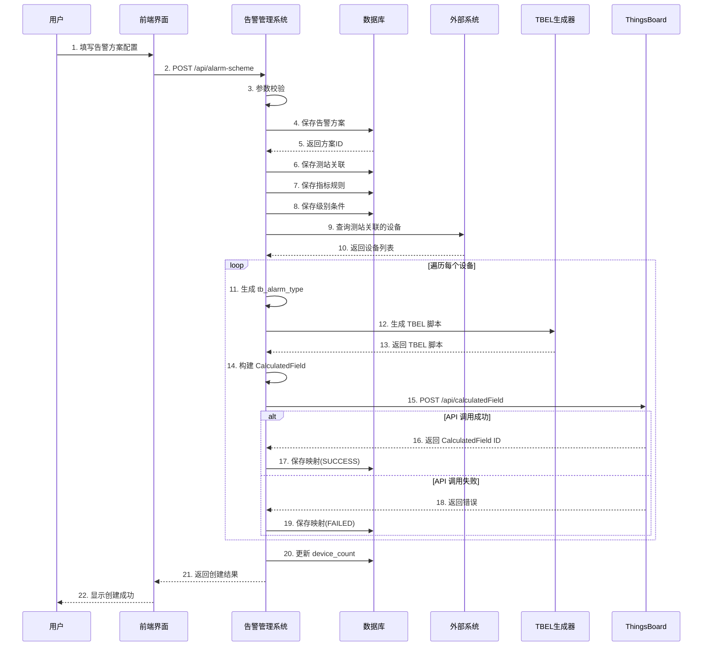
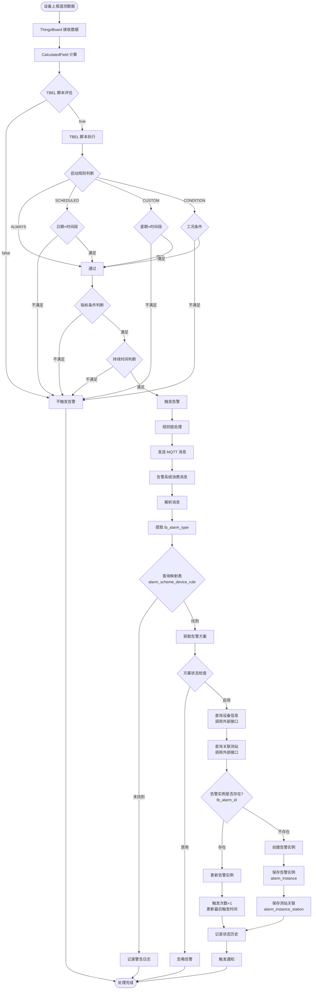
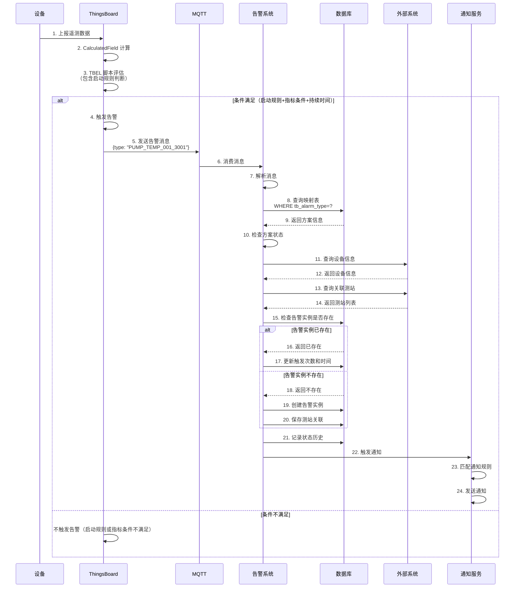
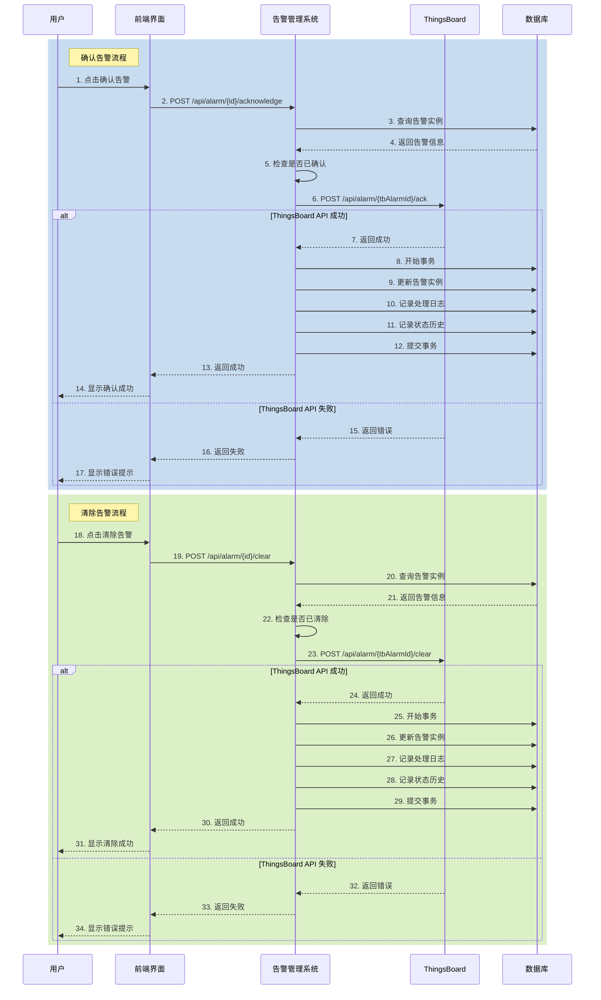
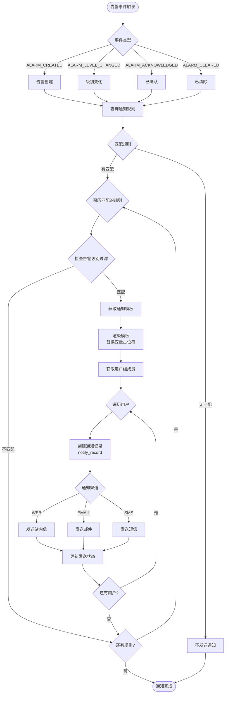
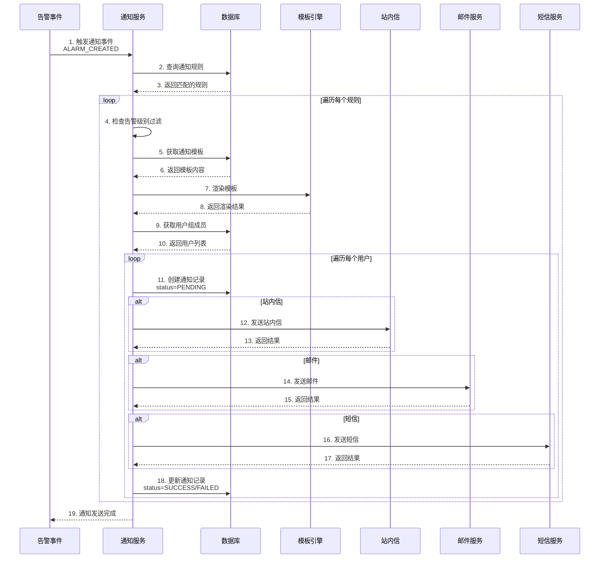
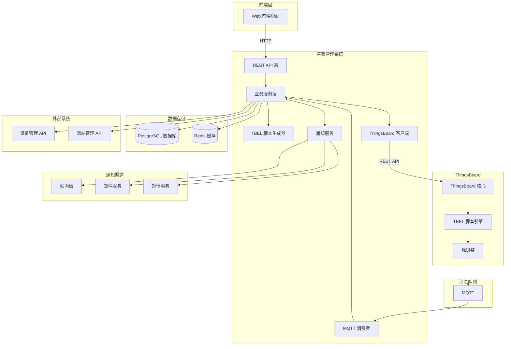
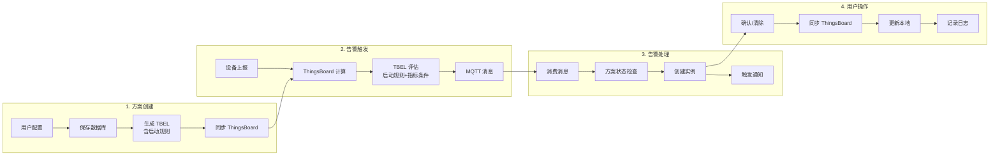

# 告警管理系统流程图和时序图

## 目录
1. [告警方案创建流程](#一告警方案创建流程)
2. [告警触发流程](#二告警触发流程)
3. [告警处理流程](#三告警处理流程)
4. [通知发送流程](#四通知发送流程)
5. [完整系统架构图](#五完整系统架构图)

---

## 一、告警方案创建流程

### 1.1 流程图

```mermaid
flowchart TD
    Start([用户创建告警方案]) --> Input[前端可视化配置]
    Input --> Config{配置内容}
    
    Config --> Basic[基本信息<br/>方案编码/名称/测站类型]
    Config --> Metric[指标规则<br/>指标/操作符/阈值/持续时间]
    Config --> Enable[启动规则<br/>ALWAYS/SCHEDULED/CUSTOM/CONDITION]
    Config --> Station[关联测站]
    
    Basic --> Submit[提交保存]
    Metric --> Submit
    Enable --> Submit
    Station --> Submit
    
    Submit --> Validate{参数校验}
    Validate -->|失败| Error1[返回错误提示]
    Validate -->|成功| SaveDB[(保存到数据库)]
    
    SaveDB --> SaveScheme[保存告警方案<br/>alarm_scheme]
    SaveScheme --> SaveStation[保存测站关联<br/>alarm_scheme_station]
    SaveStation --> SaveMetric[保存指标规则<br/>alarm_scheme_metric_rule]
    SaveMetric --> SaveCondition[保存级别条件<br/>alarm_level_condition]
    
    SaveCondition --> QueryDevice[查询测站关联的设备<br/>调用外部接口]
    QueryDevice --> LoopDevice{遍历每个设备}
    
    LoopDevice --> GenType[生成 tb_alarm_type<br/>{scheme_code}_{device_id}]
    GenType --> GenTBEL[生成 TBEL 脚本<br/>包含启动规则判断]
    
    GenTBEL --> BuildCF[构建 CalculatedField<br/>expression = TBEL 脚本]
    BuildCF --> CallTB[调用 ThingsBoard API<br/>POST /api/calculatedField]
    
    CallTB --> TBSuccess{API 调用成功?}
    TBSuccess -->|失败| SaveFailed[保存映射记录<br/>sync_status=FAILED]
    TBSuccess -->|成功| SaveSuccess[保存映射记录<br/>sync_status=SUCCESS<br/>tb_calculated_field_id]
    
    SaveFailed --> NextDevice{还有设备?}
    SaveSuccess --> NextDevice
    
    NextDevice -->|是| LoopDevice
    NextDevice -->|否| UpdateCount[更新设备数量<br/>device_count]
    
    UpdateCount --> End([创建完成])
    Error1 --> End
```

### 1.2 时序图



---

## 二、告警触发流程

### 2.1 流程图



### 2.2 时序图



---

## 三、告警处理流程

### 3.1 确认告警流程图

```mermaid
flowchart TD
    Start([用户点击确认告警]) --> Input[输入确认备注]
    Input --> Submit[提交确认]
    
    Submit --> Validate{参数校验}
    Validate -->|失败| Error[返回错误提示]
    Validate -->|成功| QueryAlarm[查询告警实例]
    
    QueryAlarm --> CheckExist{告警是否存在?}
    CheckExist -->|否| Error
    CheckExist -->|是| CheckAcked{是否已确认?}
    
    CheckAcked -->|是| Error
    CheckAcked -->|否| CallTB[调用 ThingsBoard API<br/>POST /api/alarm/{id}/ack]
    
    CallTB --> TBResult{API 调用结果}
    TBResult -->|失败| Error
    TBResult -->|成功| UpdateLocal[更新本地数据库<br/>事务开始]
    
    UpdateLocal --> SetTime[设置 acknowledged_time]
    SetTime --> SetUser[设置 acknowledged_by]
    SetUser --> SetRemark[设置 acknowledged_remark]
    SetRemark --> SetStatus[设置 alarm_status=ACKNOWLEDGED]
    
    SetStatus --> SaveLog[记录处理日志<br/>handle_type=ACKNOWLEDGE]
    SaveLog --> SaveHistory[记录状态历史<br/>ACTIVE→ACKNOWLEDGED]
    
    SaveHistory --> Commit[提交事务]
    Commit --> Success([确认成功])
    Error --> End([结束])
    Success --> End
```

### 3.2 清除告警流程图

```mermaid
flowchart TD
    Start([用户点击清除告警]) --> Input[输入清除备注]
    Input --> Submit[提交清除]
    
    Submit --> Validate{参数校验}
    Validate -->|失败| Error[返回错误提示]
    Validate -->|成功| QueryAlarm[查询告警实例]
    
    QueryAlarm --> CheckExist{告警是否存在?}
    CheckExist -->|否| Error
    CheckExist -->|是| CheckCleared{是否已清除?}
    
    CheckCleared -->|是| Error
    CheckCleared -->|否| CallTB[调用 ThingsBoard API<br/>POST /api/alarm/{id}/clear]
    
    CallTB --> TBResult{API 调用结果}
    TBResult -->|失败| Error
    TBResult -->|成功| UpdateLocal[更新本地数据库<br/>事务开始]
    
    UpdateLocal --> SetTime[设置 cleared_time]
    SetTime --> SetStatus[设置 alarm_status=CLEARED]
    
    SetStatus --> SaveLog[记录处理日志<br/>handle_type=CLEAR]
    SaveLog --> SaveHistory[记录状态历史<br/>ACKNOWLEDGED→CLEARED]
    
    SaveHistory --> Commit[提交事务]
    Commit --> Success([清除成功])
    Error --> End([结束])
    Success --> End
```

### 3.3 告警处理时序图



---

## 四、通知发送流程

### 4.1 流程图



### 4.2 时序图



---

## 五、完整系统架构图

### 5.1 系统架构图



### 5.2 数据流图



---

## 六、关键流程说明

### 6.1 告警方案创建关键点

1. **前端可视化配置**：用户无需编写代码
2. **TBEL 脚本生成**：后端自动生成包含启动规则的 JavaScript 脚本
3. **批量同步设备**：为每个关联设备创建 CalculatedField
4. **失败重试机制**：同步失败的记录可定时重试

### 6.2 告警触发关键点

1. **ThingsBoard 计算**：TBEL 脚本在 ThingsBoard 执行
2. **启动规则判断**：在 TBEL 脚本中完成，不满足不触发
3. **MQTT 解耦**：通过消息队列异步处理
4. **方案状态检查**：告警系统侧只检查方案是否启用
5. **幂等性处理**：重复消息只更新触发次数

### 6.3 告警处理关键点

1. **先同步后更新**：确保 ThingsBoard 和本地一致
2. **事务保证**：API 失败时回滚本地操作
3. **操作分类**：确认/清除需同步，委托/处置不需要
4. **日志记录**：完整的操作审计

### 6.4 通知发送关键点

1. **规则匹配**：根据事件类型和告警级别匹配
2. **模板渲染**：支持变量占位符
3. **多渠道发送**：WEB/EMAIL/SMS 独立发送
4. **失败重试**：发送失败自动重试

---

## 七、性能优化点

### 7.1 告警方案创建
- 批量同步使用线程池
- 限流控制（50 次/秒）
- 失败记录异步重试

### 7.2 告警触发
- MQTT 并发消费
- 外部接口结果缓存
- 数据库批量插入

### 7.3 通知发送
- 异步发送
- 消息队列削峰
- 失败重试机制

---

**文档版本**：V1.0  
**创建日期**：2026-03-03  
**工具**：Mermaid 流程图
